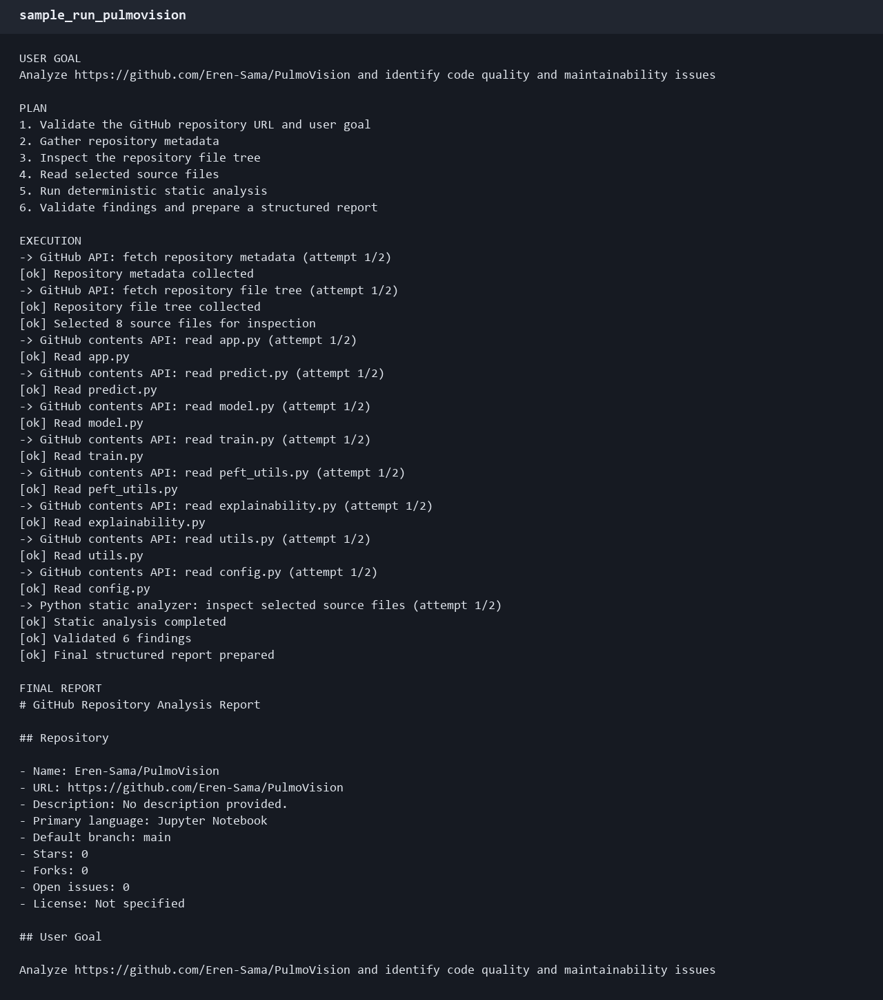
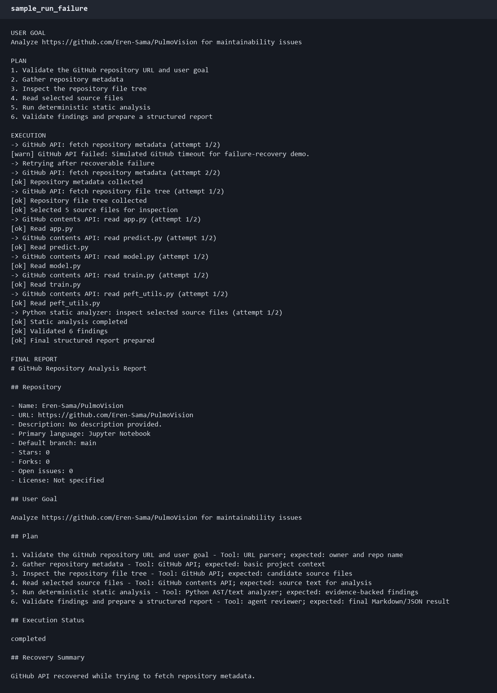

# Specter: GitHub Repository Analysis Agent

A small agentic AI system that analyzes GitHub repositories for code quality and maintainability issues.

```bash
python -m repo_agent "Analyze https://github.com/pallets/flask and identify maintainability issues"
```

It builds a goal-dependent plan, calls tools step by step, handles failures with exponential backoff, and writes a structured Markdown + JSON report.

## How it works

1. Parse the goal and extract the GitHub URL
2. Build a plan based on what the goal asks for (code quality vs metadata vs test coverage)
3. Check the repo exists (handles 404s gracefully)
4. Fetch metadata and file tree via GitHub API
5. Download and analyze selected source files using Python AST + text checks
6. Validate findings and generate the report

The optional LLM summarizer only runs when `GROQ_API_KEY` is set. Everything else is deterministic Python.

## Setup

Requires **Python 3.10+**. No dependencies to install.

```bash
cd Specter
python -m repo_agent --help
```

For higher GitHub API limits:

```bash
set GITHUB_TOKEN=your_token_here
```

For optional LLM wording:

```bash
set GROQ_API_KEY=your_key_here
```

## Usage

### Basic analysis

```bash
python -m repo_agent "Analyze https://github.com/pallets/flask for code quality issues" --max-files 8
```

### Failure recovery demo

```bash
python -m repo_agent "Analyze https://github.com/pallets/flask" --demo-failure --max-files 5
```

The first API call fails (simulated timeout), the agent waits with backoff, retries, and continues.

### Real 404 handling

```bash
python -m repo_agent "Analyze https://github.com/nonexistent/fakerepo123456"
```

### Logging

```bash
python -m repo_agent "Analyze https://github.com/pallets/flask" --log-file logs/run.jsonl --verbose
```

### Agent self-evaluation

```bash
python -m repo_agent "Analyze https://github.com/pallets/flask" --evaluate --max-files 5
```

```
--- Agent Evaluation ---
Plan steps:         7
Tool calls made:    10
Successful:         10
Failures:           0
Recovered:          0
Findings produced:  12
Elapsed:            5.4s
Success rate:       100%
```

## Architecture

See [docs/architecture.md](docs/architecture.md).

## Sample Runs

- [Normal runs](docs/sample_run_normal.md)
- [Failure and recovery](docs/sample_run_failure.md)
- [Invalid input](docs/sample_run_invalid_input.md)
- [Real 404](docs/sample_run_real_failure.md)
- [PulmoVision](docs/sample_run_pulmovision.md) — [report](reports/pulmovision_report.md)
- [StartupScout](docs/sample_run_startupscout.md) — [report](reports/startupscout_report.md)
- [Failure demo](docs/sample_run_failure.md) — [report](reports/failure_demo_report.md)

### Screenshots





## Tests

```bash
python -m unittest discover -s tests -v
```

20 tests covering URL parsing, file selection, static analysis, goal-dependent planning, retry recovery, retry exhaustion, LLM integration, 404 handling, JSON serialization, timing, and fixture-based analysis.

## Limitations

- Only checks simple maintainability signals — not guaranteed bugs
- Analyzes a limited number of files per run (rate limit friendly)
- Skips large files and vendor/generated directories
- Full AST analysis only for Python files
