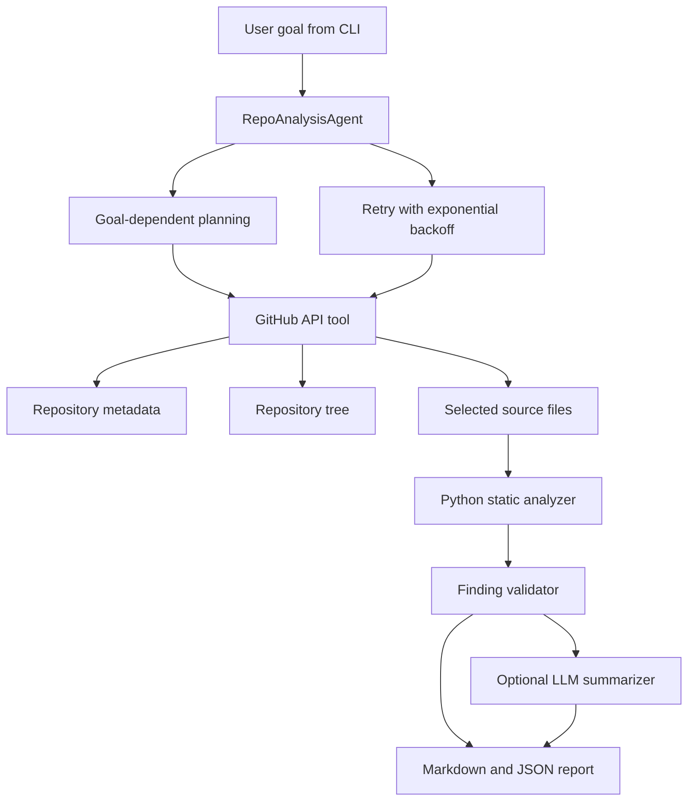
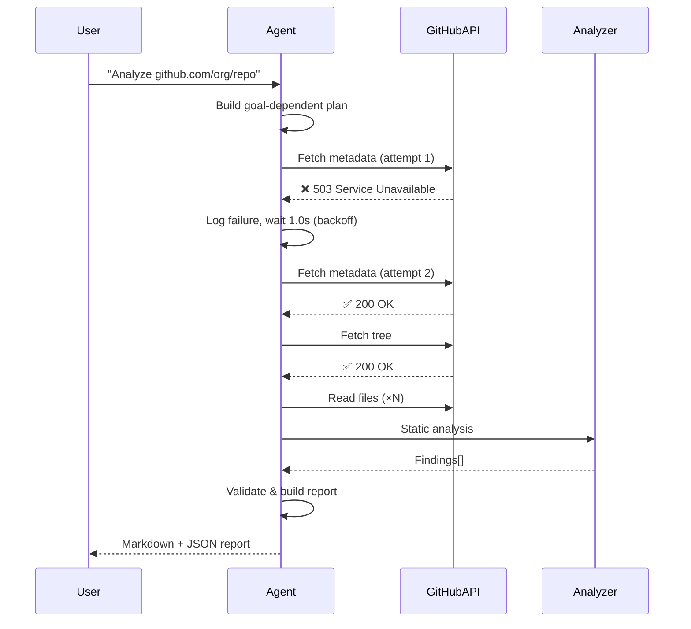

# Architecture

## Retry flow

## Components

- **RepoAnalysisAgent** — orchestrates everything: planning, tool calls, retries, validation, report.
- **GitHubTool** — GitHub REST API wrapper with caching.
- **StaticAnalyzer** — text checks + Python AST checks.
- **FailureInjector** — simulates transient failures for demos.
- **reporting.py** — converts results into Markdown and JSON.
- **OptionalLLMSummarizer** — optional Groq API call for nicer wording.
- **logger.py** — structured logging (console + JSON file).
